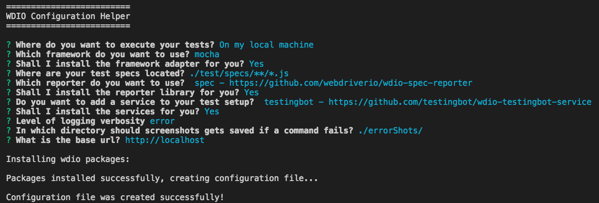
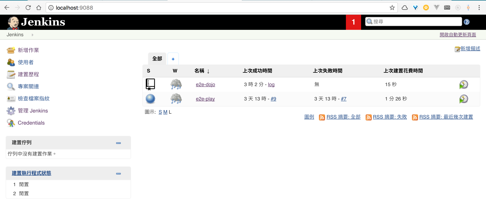
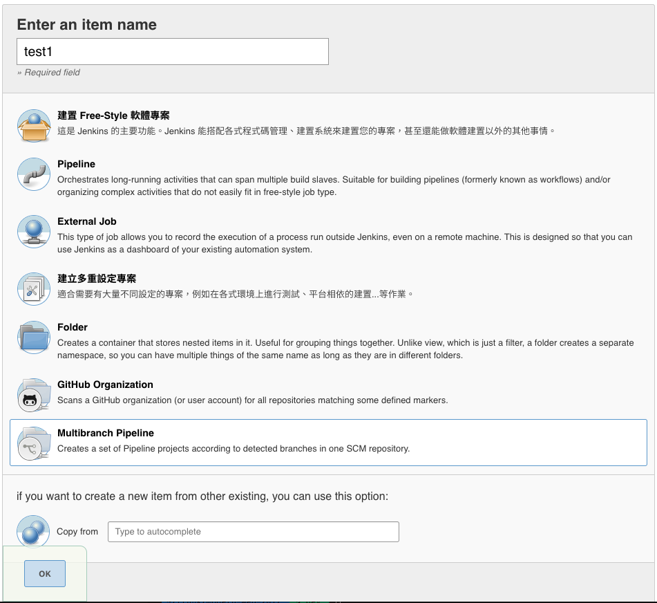
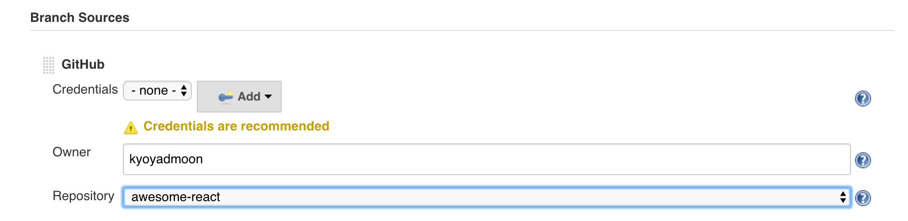
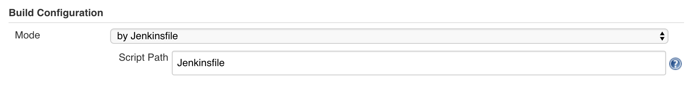
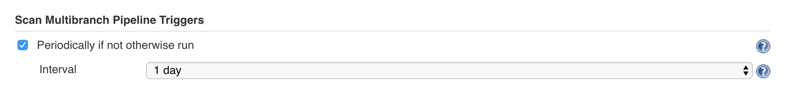
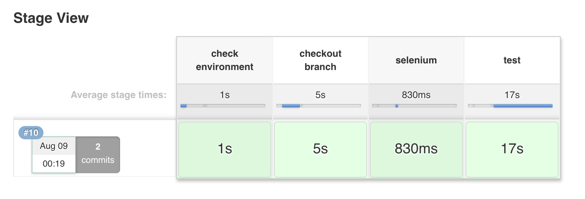
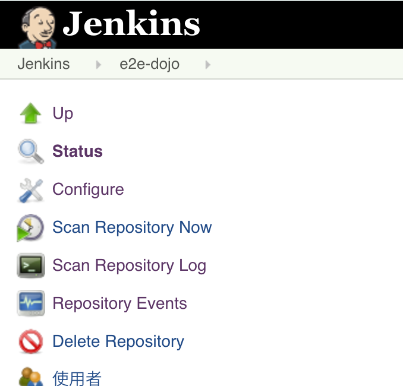
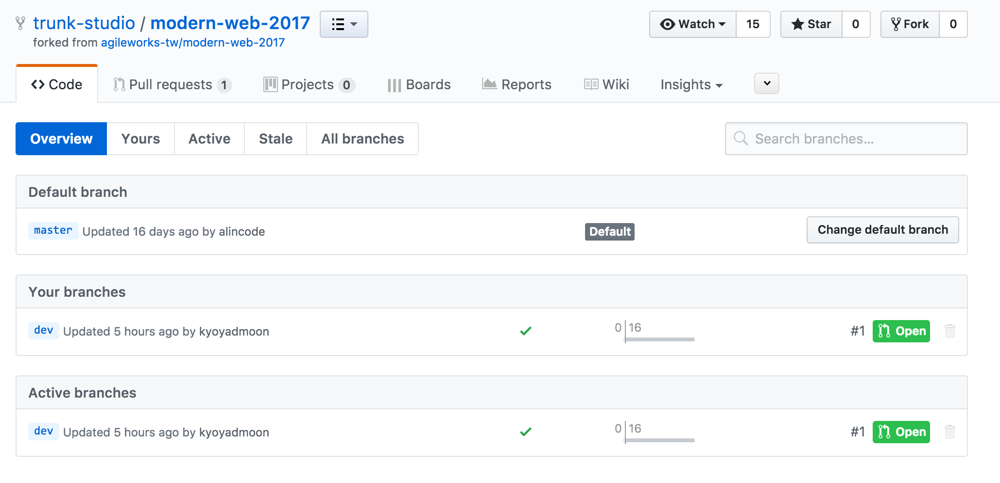
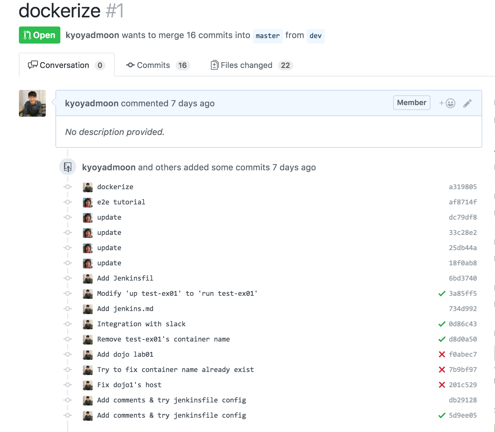

# E2E Website Testing Dojo

**協力單位：創科資訊**

### 緣由

在現今的 web 開發，軟體技術推成出新，開發方式也不停的進化，唯有測試是在開發的過程中，最容易被忽略，一但專案啟動時未考量到對於品質的控管，在開發的中後期要在加入，將會困難重重...

但技術的演進，也讓測試的進行更加的容易，期望透過簡單體驗的形式，讓大家可以了解 web e2e 測試的運作沒有想像中的複雜，並且搭配 CI 自動化程序進行自動化測試，除了自己測試之外，也讓 CI 自動進行整體自動化測試，也經由這樣的體驗，了解測試其實不難，在相關測試技術的幫忙下，可以有效率的進行，進而提高測試導入的意願。


### 預計計畫

以兩個電腦為一組

電腦 A：CI 持續整合 server
電腦 B：使用者編寫 e2e 測試

預計將會設計一個測試情境，讓使用者完成事先定義好的測試案例

然後會準備三個情境

本機開發 e2e 測試- develop
docker 本機開發 e2e 測試 - production
搭配 CI 執行 e2e 測試- test

透過相關環境的預先建置，省去使用者要進行測試時需要進行環境建置的麻煩。

另外會有一組解說，環境建置的細節。

### 期望效果

透過此練習，讓學員可以認識 e2e 測試也可以很簡單，也讓學員了解到測試如何在持續整合中進行自動化測試，並且進一步加強相關課程的宣傳。


### E2E Website Testing Dojo

體驗技術最快的方式，莫過於自己動手做，測試在一定程度複雜的專案都知道其必要性，但卻最常被忽略，一但專案啟動時未考量到對於品質的控管，在開發的中後期要在加入，將會困難重重...

所幸技術的演進，也讓測試的進行更加的容易，透過設計好的 Hands-On Labs，讓大家了解 E2E Website 測試的運作
並且搭配 CI（持續整合）進行自動化測試，體驗在專案的開發上，根據不同狀況盡讓測試協助開發。

- [Dojo 1：develop Auto testing mode: 前端 E2E Testing](e2eSample)

開發離不開測試，透過此 Dojo 了解在工程師的開發環境下，如何撰寫 E2E Testing

- Dojo 2：前端 E2E (End to End) Testing with Docker

實際動手做，了解如何使用 Docker 進行自動化的 E2E 前端測試，讓前端測試更容易進行，即使沒有桌面環境，透過 Docker 的協助，只要有 Docker 的運作環境，可在任何地方進行前端測試。

- Dojo 3：Run Auto testing mode: 前端 E2E Testing With CI

E2E Testing 透過 CI 搭配 Docker 運行，讓 CI 即使沒有安裝 UI 環境或是 Browser 即可以進行前端自動化測試，更靈活地搭配 Docker 進行部署與測試、強化開發流程。

---


# Dojo 1：develop Auto testing mode: 前端 E2E Testing

開發離不開測試，透過此 Dojo 了解在工程師的開發環境下，如何撰寫 E2E Testing。

**練習目標**

- 輕鬆使用前端測試框架來撰寫網站自動化測試程式
- 使用 Page Object 來簡化自動化程式維護的負擔

## WebdriverIO 初始化專案

```
// 新增空的專案資料夾
mkdir demo

cd demo

// 初始化 npm 專案
npm init -y

// 安裝 webdriverio 模組
npm install webdriverio --save-dev
```

**產生 Webdriverio 設定檔**



```
// 執行 CLI (Mac)
$ node_modules/.bin/wdio

// 執行 CLI (Window)
$ node_modules\.bin\wdio

=========================
WDIO Configuration Helper
=========================

選擇你的執行環境
? Where do you want to execute your tests? On my local machine

選擇你要使用的測試框架
? Which framework do you want to use? mocha

你要安裝測試框架的 adapter 嗎？
? Shall I install the framework adapter for you? Yes

設定你預計測試程式放置的資料夾位置
? Where are your test specs located? 

選擇你想要的報表格式
? Which reporter do you want to use?

你要安裝報表函式庫嗎？
? Shall I install the reporter library for you? 

你想要新增服務到你的測試專案嗎？
? Do you want to add a service to your test setup?

你要安裝服務嗎？
? Shall I install the services for you?

設定 log 的層級
? Level of logging verbosity silent

設定測試失敗後，截圖放置位置
? In which directory should screenshots gets saved if a command fails?

設定將要測試的網站的 domain url
? What is the base url? 
```

**執行方式**

1. 編輯 `package.json`
2. 把 script test 指令設定為 `wdio wdio.conf.js`
3. 執行 `npm test`

## WebdriverIO 常用指令 (API) 語法

<http://webdriver.io/api.html>

**指令種類**

- Protocol
- Action
- Utility
- Property
- State
- Mobile (暫時跳過)

### Protocol

**選取元素**

```js
browser.element('div');
$('div');

browser.elements('div');
$$('div');
```

**前往某網址**

```js
browser.url('http://www.google.com');
```

### Action

**設定欄位的值**

```js
browser.element('.email').setValue('aaa@bbb.com');
// 縮寫
$('.email').setValue('aaa@bbb.com');
```

**點選欄位的值**

```js
browser.click('.some-button');

// 縮寫
$('.some-button').click();

$('[title="Sign Out"]').click();
```

### Utility

**檢查某個元素是否存在**

```js
browser.waitForExist('.alert-text');

// 縮寫
$('.alert-text').waitForExist();
```

**暫停**

```js
browser.pause(5000);
```

**除錯**

```js
browser.debug();
```

**加命令**

```js
browser.addCommand();
```

**waitForExist**

```js
browser.element('.notification').waitForExist();
browser.element('.notification').waitForExist(5000);
browser.element('.notification').waitForExist(5000, true);
// 或
browser.waitForExist('.notification');
browser.waitForExist('.notification', 5000);
browser.waitForExist('.notification', 5000, true);
```

**saveScreenshot**

```js
browser.saveScreenshot('front_page.png');
```

**end**

```js
client
    .init()
    .url('http://google.com')
    .end();
    // ends session and close browser
```

### Property

**取得某個元素的文字**

```js
browser.getText('.alert-text');

// 縮寫
$('.alert-text').getText();
```

**取得某個元素的值**

```js
browser.getValue('input[name=email]');
```

**取得標題**

```js
browser.getTitle();
```

**取得網址**

```js
browser.getUrl();
```

### State

**isEnabled**

```html
<input type="text" name="inputField" class="input1">
<input type="text" name="inputField" class="input2" disabled>
<input type="text" name="inputField" class="input3" disabled="disabled">
```

```js
var isEnabled = browser.isEnabled('.input1');
console.log(isEnabled); // outputs: true
var isEnabled2 = browser.isEnabled('.input2');
console.log(isEnabled2); // outputs: false
var isEnabled3 = browser.isEnabled('.input3')
console.log(isEnabled3); // outputs: false
```

**isSelected**

```html
<select name="selectbox" id="selectbox">
    <option value="Daisy">Daisy</option>
    <option value="Alin" selected="selected">Alin</option>
    <option value="Andy">Andy</option>
</select>
```

```js
$('[value="Layla Terry"]').isSelected(); // 輸出: true

browser.selectByValue('#selectbox', 'Bill Gilbert');
element.isSelected(); // 輸出: false
```

**isExisting / isVisible**

```html
<div id="notDisplayed" style="display: none"></div>
<div id="notVisible" style="visibility: hidden"></div>
<div id="notInViewport" style="position:absolute; left: 9999999"></div>
<div id="zeroOpacity" style="opacity: 0"></div>
```

```js
browser.isExisting(selector);
```

### Asert  
Assert API : https://nodejs.org/api/assert.html

```javascript
assert.equal(message, 'You have been signed out.');
```


---

# Dojo 2 : Testing with Docker 

將原本的流程拆解成三個部分

- Selenium Server
- Build Project
- Run Testing

接下來開始為這三個階段編寫其需求的容器配置

## Selenium Server

直接使用 selenium 提供的 image `selenium/standalone-firefox-debug:2.53.0`

> 要特別注意的是網路的設定，需要為 VNC 和 Selenium 留下通道

##### Selenium API Port

```yaml
    expose:
      - "4444" 
```

讓之後進行測試的容器可以透過這個 port，讓像 WebdriverIO 這樣的Selenium Client 遠端控制 Selenium Server 進行測試

##### VNC Port

```yaml
    ports:
      - "5900:5900"
```

這邊是做 Port Forwarding 讓電腦的 localhost:5900 導向到容器的 5900 port  
這樣可以透過 VNC 連線觀看瀏覽器測試的狀況

## Build Project Environment

```
  build:
    container_name: e2e_build
    image: node:7.6
    command:  bash -c "cd wd-ex01 && rm -rf node_modules && npm install && cd ../wd-ex02 && rm -rf node_modules && npm install"
    working_dir: /e2eSample
    volumes:
      - ./e2eSample:/e2eSample
```

#### 設定 volumes 掛載專案資料夾

容器應該是乾淨的執行環境
每次刪掉重啟都會是全新的
因此透過上面的 volumes 設定將本機的 e2eSample 資料夾掛載到容器中，容器中才能讀到專案程式碼

#### command 設定要執行的 script

有了專案程式碼之後就可以開始我們建置環境的 script 了，這個 sample 以 JavaScript 為例，而容器環境可能和本機不同，因此需要在容器中重新安裝 node_modules，如果專案有其他建置步驟也可將指令加入 command 中，在這階段一起完成

## Test Execution Environment

```yaml
  test-ex01:
    image: node:7.6
    command: "npm run test"
    working_dir: /e2eSample/wd-ex01
    volumes:
      - ./e2eSample:/e2eSample
    networks:
      - front-tier
```

這邊以執行 ex01 的測試檔案為例  
由於專案建置的步驟應該在上一個 `build` 階段就已經執行  
且因volume掛載同一個外部資料夾，因此安裝過的 modules 會保存下來  
因此這個容器只要需做執行測試的步驟


------

以上三個部分都配置好後

依序執行 

```bash
$ docker-compose up -d selenium # -d 表示在背景執行
$ docker-compose run --service-ports build
$ docker-compose run --service-ports test-ex01
```

---

# Dojo 3 : Testing With CI 

**以  Jenkins 為範例**

## 管理介面

透過瀏覽器開啟 `localhost:9088` 
可以進入 Jenkins 管理頁面




## 新增 Multibranch Pipeline 作業

新增作業 (dashboard 左上角) > Multibranch > OK

>  設置 Multibranch Pipeline, 當 Jenkins 發現 repo 程式碼有了新的分支或是 PR 時就會對所有新的版本進行自動化流程




## Branch Sources



透過設定 Branch Source 決定建置的專案程式碼來源  
這裡以選擇 GitHub 為例  
在 Owner 填入 GitHub ID 後  
Repository 會自動列出該 ID 的 Public Repo 供你選擇  

> 這邊建議即使是對 Public Repo 做建置設定，也要設定 Credentials ，因為在沒有身份認證的狀況下，GitHub API 呼叫次數是有限制的，而且容易沒有回應


## Build Configuration 定義流程



如圖透過設定 `by Jenkinsfile` 和 Jenkinsfile 路徑
Jenkins 將依照路徑去找到專案中的流程配置檔 `Jenkinsfile `

> 將自動化流程變成配置檔案，可以將整個流程的設定和專案程式碼一起納入版本控制中  
> 達到更好的管理和追蹤


## 設定掃描的週期

Scan Multibranch Pipeline Triggers > check `Periodically if not otherwise run`

> 可不設定週期，透過管理介面按鈕進行觸發




## 流程配置

我們將透過編輯專案根目錄下的 `Jenkinsfile`來設定建置流程  
透過 stage 可以將整個建置流程分成不同階段的分類  
依照 stage 的劃分，流程的執行結果也會如下圖 ` Stage View` 呈現  
可以更清楚的知道整個建置流程的狀況

```groovy
node {
  stage('check environment'){
    sh "whoami"
    sh "docker -v"
    sh "docker-compose -v"
    sh "docker ps"
  }
  
  stage('checkout branch') {
    /* for build */
    checkout scm
  }
}
```



> 這裡的 scm 做為搭配多個 branch 的自動化使用，當 Jenkins 偵測到需要對多個 branch 進行自動化流程時，scm 會指到當前自動化的 branch 名稱


## 手動觸發 Scan Repository Now




## Build Status on GitHub

成功觸發建置後，在 GitHub 上可以看到每個 branch, PR 版本的建置狀態
可以很清楚快速的了解程式碼版本是否符合預期



