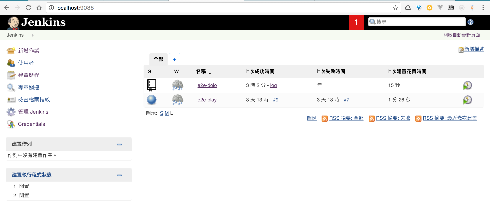
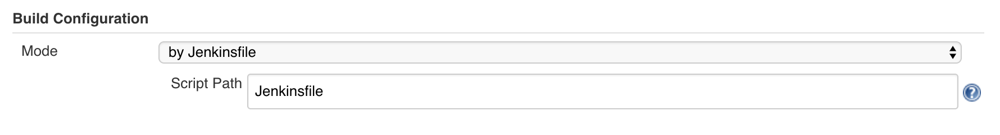
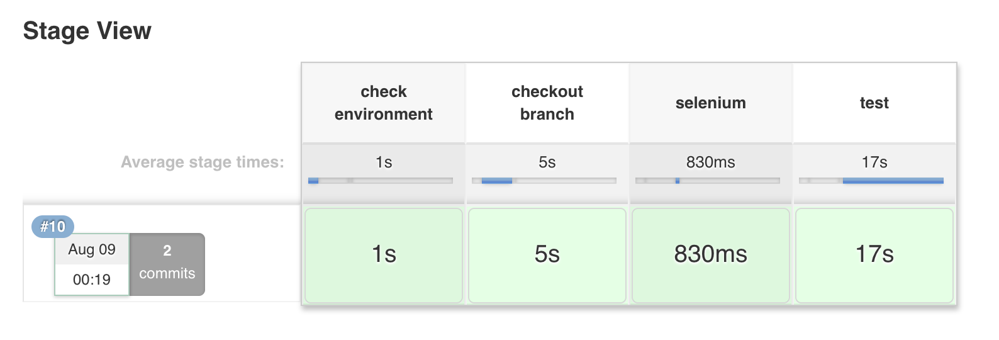
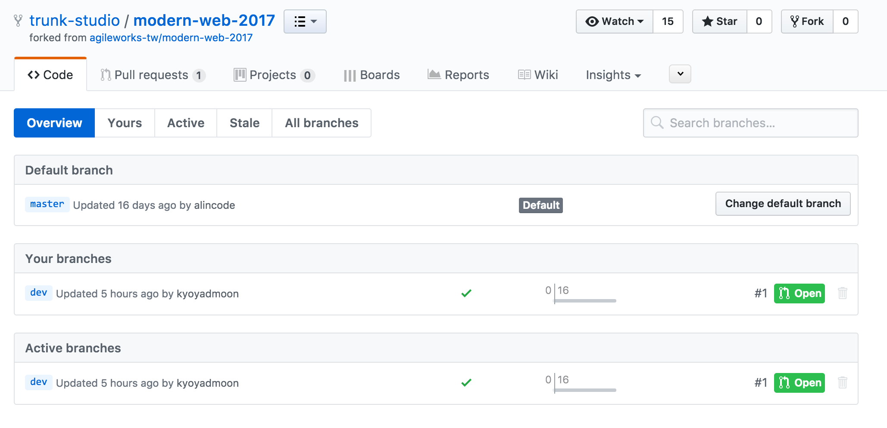

# Integration with Jenkins

[TOC]

## 管理介面

透過瀏覽器開啟 `localhost:9088` 
可以進入 Jenkins 管理頁面




## 新增 Multibranch Pipeline 作業 

新增作業 (dashboard 左上角) > Multibranch > OK

>
> 設置 Multibranch Pipeline, 當 Jenkins 發現 repo 程式碼有了新的分支或是 PR 時就會對所有新的版本進行自動化流程
>


## Branch Sources


透過設定 Branch Source 決定建置的專案程式碼來源
這裡以選擇 GitHub 為例
在 Owner 填入 GitHub ID 後
Repository 會自動列出該 ID 的 Public Repo 供你選擇

> 這邊建議即使是對 Public Repo 做建置設定，也要設定 Credentials ，因為在沒有身份認證的狀況下，GitHub API 呼叫次數是有限制的，而且容易沒有回應


## Build Configuration 定義流程



如圖透過設定 `by Jenkinsfile` 和 Jenkinsfile 路徑
Jenkins 將依照路徑去找到專案中的流程配置檔 `Jenkinsfile `

> 將自動化流程變成配置檔案，可以將整個流程的設定和專案程式碼一起納入版本控制中
> 達到更好的管理和追蹤


## 設定掃描的週期

Scan Multibranch Pipeline Triggers > check `Periodically if not otherwise run`

> 可不設定週期，透過管理介面按鈕進行觸發


## 流程配置

我們將透過編輯專案根目錄下的 `Jenkinsfile`來設定建置流程
透過 stage 可以將整個建置流程分成不同階段的分類
依照 stage 的劃分，流程的執行結果也會如下圖 ` Stage View` 呈現
可以更清楚的知道整個建置流程的狀況

```groovy
node {
  stage('check environment'){
    sh "whoami"
    sh "docker -v"
    sh "docker-compose -v"
    sh "docker ps"
  }
  
  stage('checkout branch') {
    /* for build */
    checkout scm
  }
}
```



> 這裡的 scm 做為搭配多個 branch 的自動化使用，當 Jenkins 偵測到需要對多個 branch 進行自動化流程時，scm 會指到當前自動化的 branch 名稱


## 手動觸發 Scan Repository Now


## Build Status on GitHub

成功觸發建置後，在 GitHub 上可以看到每個 branch, PR 版本的建置狀態
可以很清楚快速的了解程式碼版本是否符合預期



