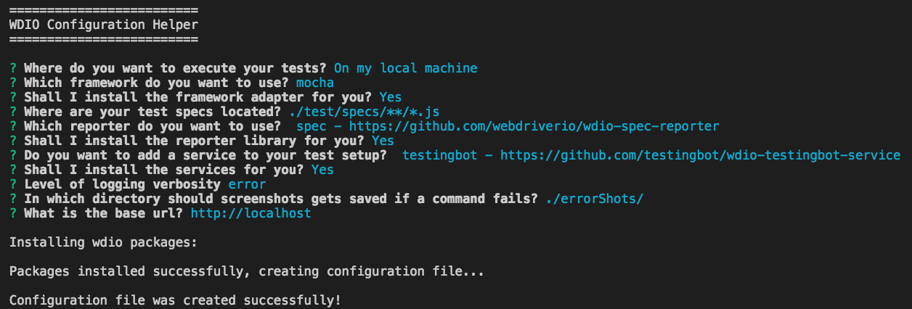

# Dojo 1：develop Auto testing mode: 前端 E2E Testing

開發離不開測試，透過此 Dojo 了解在工程師的開發環境下，如何撰寫 E2E Testing。

**練習目標**

* 輕鬆使用前端測試框架來撰寫網站自動化測試程式
* 使用 Page Object 來簡化自動化程式維護的負擔

## WebdriverIO 初始化專案

```
// 新增空的專案資料夾
mkdir demo

cd demo

// 初始化 npm 專案
npm init -y

// 安裝 webdriverio 模組
npm install webdriverio --save-dev
```

**產生 Webdriverio 設定檔**



```
// 執行 CLI (Mac)
$ node_modules/.bin/wdio

// 執行 CLI (Window)
$ node_modules\.bin\wdio

=========================
WDIO Configuration Helper
=========================

選擇你的執行環境
? Where do you want to execute your tests? On my local machine

選擇你要使用的測試框架
? Which framework do you want to use? mocha

你要安裝測試框架的 adapter 嗎？
? Shall I install the framework adapter for you? Yes

設定你預計測試程式放置的資料夾位置
? Where are your test specs located? 

選擇你想要的報表格式
? Which reporter do you want to use?

你要安裝報表函式庫嗎？
? Shall I install the reporter library for you? 

你想要新增服務到你的測試專案嗎？
? Do you want to add a service to your test setup?

你要安裝服務嗎？
? Shall I install the services for you?

設定 log 的層級
? Level of logging verbosity silent

設定測試失敗後，截圖放置位置
? In which directory should screenshots gets saved if a command fails?

設定將要測試的網站的 domain url
? What is the base url? 
```

**執行方式**

1. 編輯 `package.json`
2. 把 script test 指令設定為 `wdio wdio.conf.js`
3. 執行 `npm test`

## WebdriverIO 常用指令 (API) 語法

<http://webdriver.io/api.html>

**指令種類**

* Protocol
* Action
* Utility
* Property
* State
* Mobile (暫時跳過)

### Protocol

**選取元素**

```js
browser.element('div');
$('div');

browser.elements('div');
$$('div');
```

**前往某網址**

```js
browser.url('http://www.google.com');
```

### Action

**設定欄位的值**

```js
browser.element('.email').setValue('aaa@bbb.com');
// 縮寫
$('.email').setValue('aaa@bbb.com');
```

**點選欄位的值**

```js
browser.click('.some-button');

// 縮寫
$('.some-button').click();

$('[title="Sign Out"]').click();
```

### Utility

**檢查某個元素是否存在**

```js
browser.waitForExist('.alert-text');

// 縮寫
$('.alert-text').waitForExist();
```

**暫停**

```js
browser.pause(5000);
```

**除錯**

```js
browser.debug();
```

**加命令**

```js
browser.addCommand();
```

**waitForExist**

```js
browser.element('.notification').waitForExist();
browser.element('.notification').waitForExist(5000);
browser.element('.notification').waitForExist(5000, true);
// 或
browser.waitForExist('.notification');
browser.waitForExist('.notification', 5000);
browser.waitForExist('.notification', 5000, true);
```

**saveScreenshot**

```js
browser.saveScreenshot('front_page.png');
```

**end**

```js
client
    .init()
    .url('http://google.com')
    .end();
    // ends session and close browser
```

### Property

**取得某個元素的文字**

```js
browser.getText('.alert-text');

// 縮寫
$('.alert-text').getText();
```

**取得某個元素的值**

```js
browser.getValue('input[name=email]');
```

**取得標題**

```js
browser.getTitle();
```

**取得網址**

```js
browser.getUrl();
```

### State

**isEnabled**

```html
<input type="text" name="inputField" class="input1">
<input type="text" name="inputField" class="input2" disabled>
<input type="text" name="inputField" class="input3" disabled="disabled">
```

```js
var isEnabled = browser.isEnabled('.input1');
console.log(isEnabled); // outputs: true
var isEnabled2 = browser.isEnabled('.input2');
console.log(isEnabled2); // outputs: false
var isEnabled3 = browser.isEnabled('.input3')
console.log(isEnabled3); // outputs: false
```

**isSelected**

```html
<select name="selectbox" id="selectbox">
    <option value="Daisy">Daisy</option>
    <option value="Alin" selected="selected">Alin</option>
    <option value="Andy">Andy</option>
</select>
```

```js
$('[value="Layla Terry"]').isSelected(); // 輸出: true

browser.selectByValue('#selectbox', 'Bill Gilbert');
element.isSelected(); // 輸出: false
```

**isExisting / isVisible**

```html
<div id="notDisplayed" style="display: none"></div>
<div id="notVisible" style="visibility: hidden"></div>
<div id="notInViewport" style="position:absolute; left: 9999999"></div>
<div id="zeroOpacity" style="opacity: 0"></div>
```

```js
browser.isExisting(selector);
```
